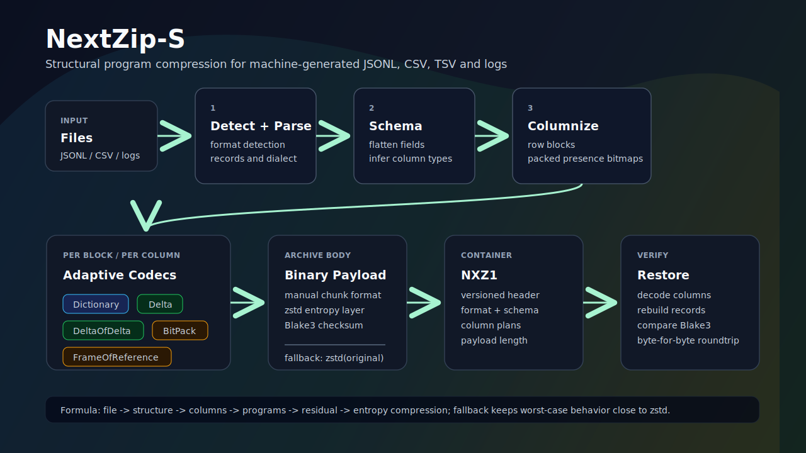

# NextZip-S

**Structural program compression for machine-generated data.** NextZip-S is a
Rust archive format and CLI that compresses JSONL, CSV/TSV, and logs by finding
record structure, splitting it into columns, choosing compact reconstruction
programs, and falling back to zstd when structure does not help.

Current release target: `0.1.0-alpha`.



## Why

General-purpose compressors see bytes. NextZip-S tries to see the program that
generated the bytes:

```text
ordinary archive: bytes -> entropy compression
NextZip-S:       file -> structure -> columns -> programs -> residual -> entropy compression
```

The goal is not to beat zstd on every file. The goal is to strongly compress
structured machine data while keeping byte-for-byte restoration and safe
fallback behavior.

## Features

- CLI: `pack`, `unpack`, `inspect`, `bench`
- Formats: JSONL, CSV, TSV, template-style logs, binary fallback
- Mixed log templates with per-row field-order preservation
- Structural row-block payload with per-block/per-column codec selection
- Codecs: dictionary, delta, delta-of-delta, RLE, bitpack, frame-of-reference, raw
- Packed presence bitmaps and compact string dictionary indexes
- Streaming file API for binary fallback payloads
- JSONL `--exact` raw-line residual path when it beats fallback
- CSV LF/CRLF and header-order preservation
- Blake3 verification and byte-for-byte roundtrip tests
- Reproducible benchmark corpus and CI hardening

## Quick Start

```bash
git clone https://github.com/andysay1/nextzip.git
cd nextzip
cargo build --release
```

```bash
target/release/nextzip pack data.jsonl data.nxz
target/release/nextzip unpack data.nxz restored.jsonl
cmp -s data.jsonl restored.jsonl
target/release/nextzip inspect data.nxz
```

## Commands

```bash
nextzip pack input.jsonl output.nxz
nextzip unpack output.nxz restored.jsonl
nextzip inspect output.nxz
nextzip bench input.jsonl
nextzip bench benchmarks/data --json results.json
```

`pack` always verifies the structural candidate by decoding it. If the result is
not byte-for-byte identical, or if the structural archive is not smaller than
fallback, NextZip-S stores `zstd(original)` instead.

For binary fallback files, the CLI writes and reads payload data through zstd
streams instead of materializing the whole payload in memory.

## Benchmark Results

Generated locally with:

```bash
cargo build --release
python3 scripts/generate_corpus.py --rows 100000
python3 scripts/run_benchmarks.py
```

| file | type | original | nextzip | zstd | ratio vs zstd | fallback |
|---|---|---:|---:|---:|---:|---|
| `app.log` | template logs | 7,089,282 | 19,637 | 908,902 | 46.29x | false |
| `mixed.jsonl` | mixed JSONL | 10,581,683 | 282,595 | 1,207,397 | 4.27x | false |
| `random.bin` | high entropy | 2,000,000 | 2,000,179 | 2,000,061 | 1.00x | true |
| `sales.csv` | regular CSV | 4,773,914 | 1,592 | 1,212,083 | 761.36x | false |
| `sales_realistic.csv` | seeded realistic CSV | 5,523,377 | 816,570 | 1,819,072 | 2.23x | false |
| `sessions.jsonl` | sessions JSONL | 10,545,929 | 9,909 | 1,207,002 | 121.81x | false |
| `telemetry.jsonl` | telemetry JSONL | 14,645,551 | 35,716 | 718,708 | 20.12x | false |

All benchmark rows were verified with `unpack(pack(x)) == x`. See
[docs/BENCHMARK_RESULTS.md](docs/BENCHMARK_RESULTS.md) for the full table,
timings, and methodology.

Directory benchmark mode prints Markdown and can also write machine-readable
JSON:

```bash
nextzip bench benchmarks/data --json benchmarks/results/results.json
```

## Archive Layout

```text
MAGIC        NXZ1
HEADER       zstd(manual binary versioned ArchiveHeader)
PAYLOAD      zstd(manual binary row-block column chunks)
CHECKSUM     blake3(original)
```

Payload chunks are independently decoded per block and column. `inspect` also
reports actual block-level codec statistics. Fallback payloads use the same
container but are streamed by the file API. See [docs/FORMAT.md](docs/FORMAT.md)
for the current alpha format.

## Validation

```bash
cargo fmt --check
cargo clippy --all-targets -- -D warnings
cargo test
cargo build --release
```

Current test coverage includes integration roundtrips, property-style generated
JSONL/CSV/log cases, CSV dialect regressions, and corrupt archive rejection.

## Documentation

- [Format](docs/FORMAT.md)
- [Benchmark methodology](docs/BENCHMARK.md)
- [Benchmark results](docs/BENCHMARK_RESULTS.md)
- [Project status](docs/PROJECT_STATUS.md)
- [Release checklist](docs/RELEASE.md)
- [Commercial licensing](docs/COMMERCIAL_LICENSE.md)

## License

NextZip-S is source-available under the
[PolyForm Noncommercial License 1.0.0](LICENSE).

Personal, research, educational, and other noncommercial use is permitted.
Commercial use requires a separate commercial license from the project owner.
